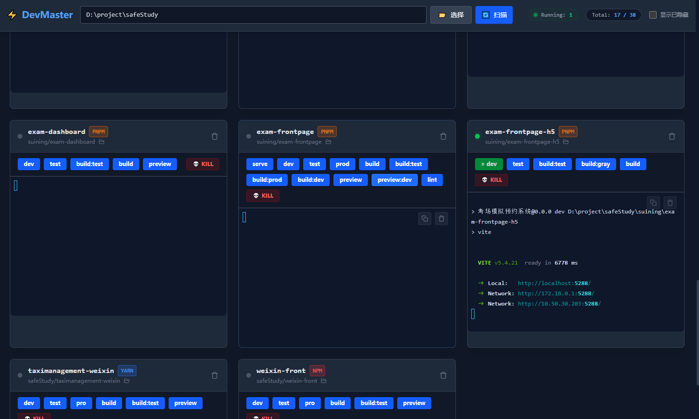

<div align="center">
  
  <h1>DevMaster</h1>
  <p>
    <b>新一代跨平台开发管理工具</b>
  </p>
  <p>
    基于 Electron 33 + Vue + Express 构建，专为开发者打造的高效工作台。
  </p>

  <a href="https://github.com/WEBNSNM/dev-manage/actions">
    
  </a>
  
  
  
  

  <br><br>
  
  [下载最新版本](https://github.com/WEBNSNM/dev-manage/releases/latest) • [报告 Bug](https://github.com/WEBNSNM/dev-manage/issues)
</div>

---
## ✨ 项目简介 (Introduction)

* **🖥 可视化控制台**: 像驾驶舱一样管理你的项目。直观地查看项目列表、状态和关键信息，无需在文件资源管理器中反复跳转。
**DevMaster** 是一个现代化的桌面端开发管理应用。是一个集成了 **前端界面 (Vue)**、**本地后端服务 (Express)** 和 **实时通信 (Socket.io)** 的完整全栈解决方案。

无论你是需要管理本地进程、监控系统状态，还是进行远程服务器管理 (SSH)，DevMaster 都能提供流畅的原生体验。

<div align="center">

</div>

## 📦 下载与安装 (Download)

请访问我们的 [GitHub Releases](https://github.com/WEBNSNM/dev-manage/releases) 页面下载适合你系统的版本：

| 操作系统 | 文件类型 | 说明 |
| :--- | :--- | :--- |
| **Windows** | `DevMaster Setup x.x.x.exe` | 推荐，包含自动更新功能 |
| **macOS** | `DevMaster-x.x.x.dmg` | 支持 M1/M2/M3 及 Intel 芯片 |

## 🛠 本地开发 (Development)

如果你想参与贡献或在本地运行代码，请按以下步骤操作。

### 环境要求
* Node.js >= 20.0.0 (推荐 v22 LTS)
* npm 或 pnpm

### 1. 克隆项目
```bash
git clone [https://github.com/WEBNSNM/dev-manage.git](https://github.com/WEBNSNM/dev-manage.git)
cd dev-manage
```
### 2.安装根目录及所有子模块依赖
```bash
npm install
# 或者
pnpm install
```

### 3.运行
```bash
npm run dev
```
### 4.构建win、mac系统平台的安装包
```bash
npm run dist
```
